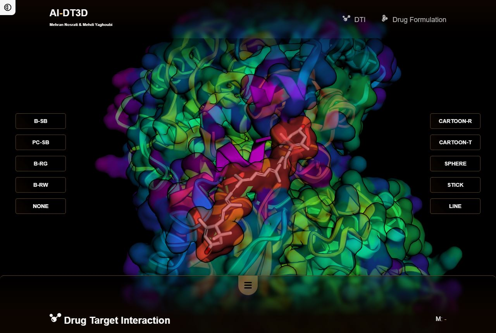
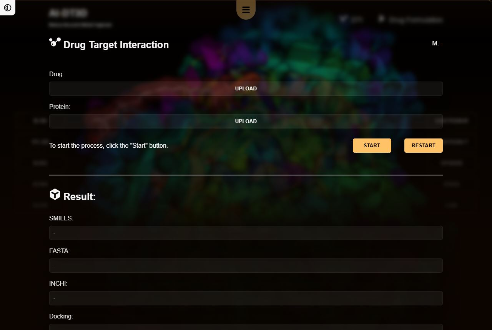
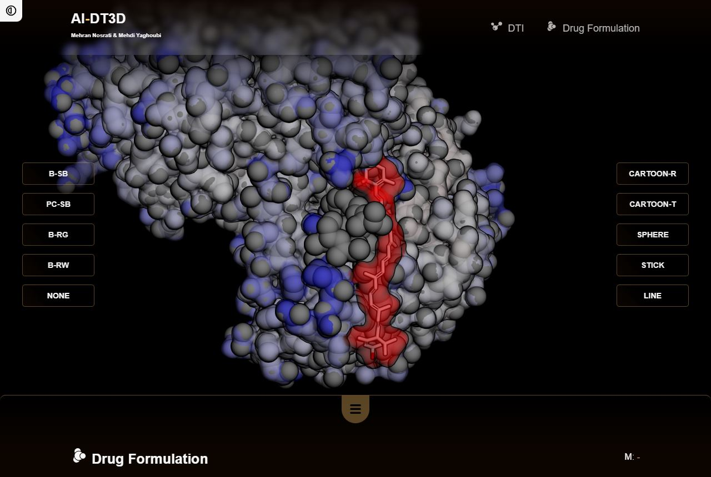
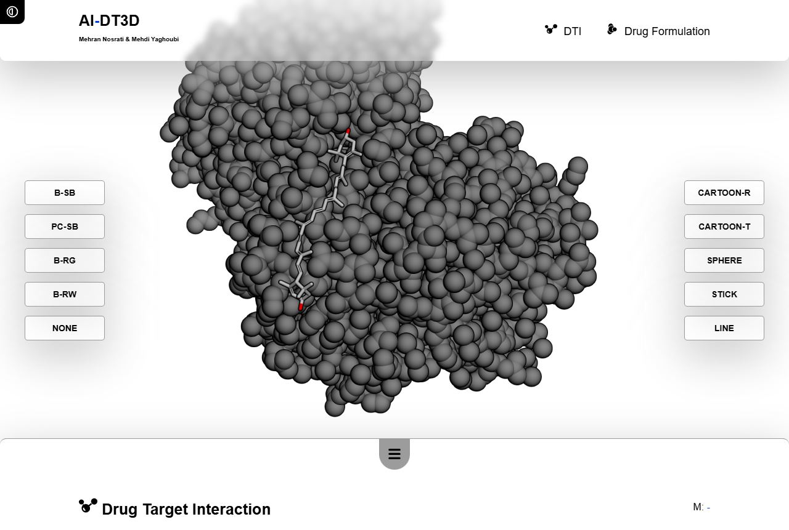
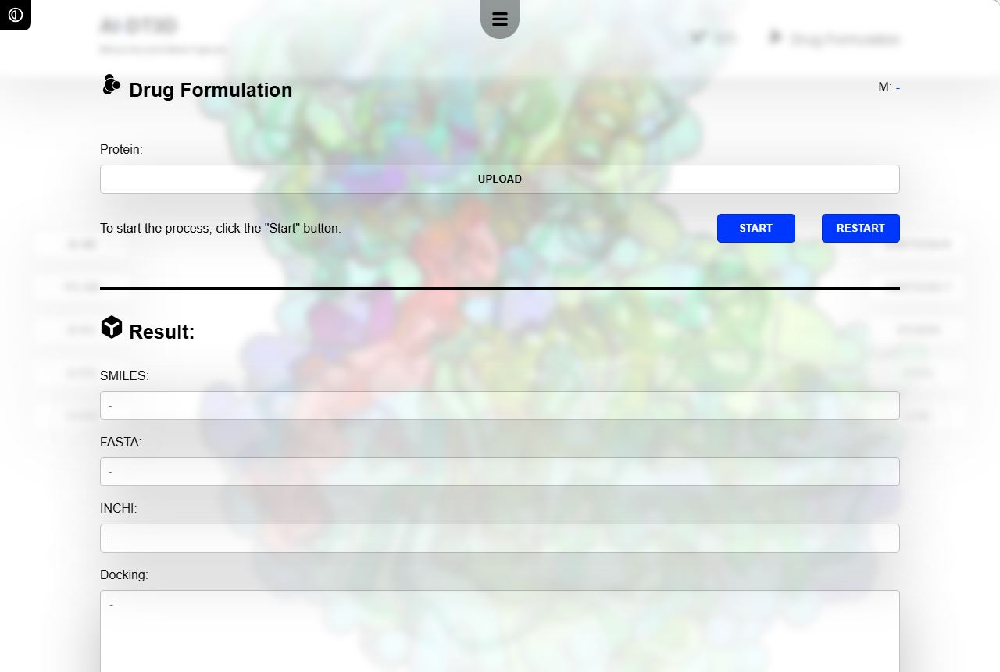
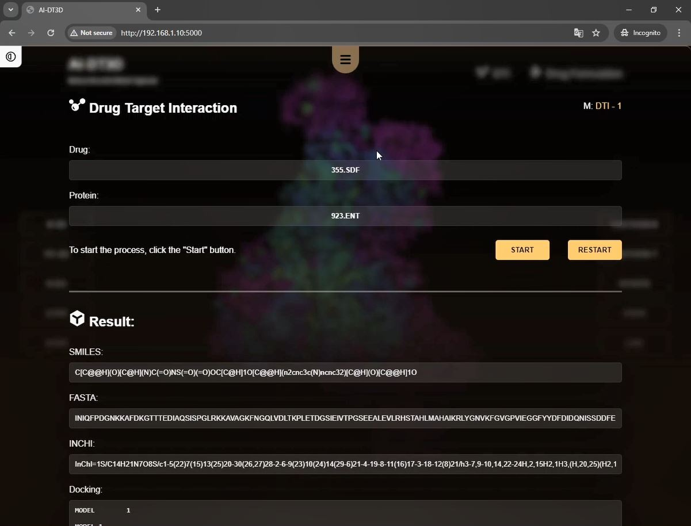

# SDIFS

**
Smart Drug Interaction &amp; Formulation System
**

 

این معماری، یک سامانه جامع و چندمنظوره تحت وب برای طراحی دارو و پیش‌بینی تعامل میان دارو و هدف پروتئینی است که دو کاربرد اصلی و مستقل دارد. کاربرد اول، به تولید فرمولاسیون دارویی جدید برای یک پروتئین مشخص می‌پردازد و کاربرد دوم، ارزیابی تعامل میان یک داروی موجود و یک پروتئین معین و شناسایی مکان اتصال آن‌ها را بر عهده دارد. هر یک از این دو کاربرد در ادامه به‌تفصیل تشریح شده‌اند تا اجزای مختلف معماری به‌خوبی معرفی شوند.

 

 
کاربرد اول: طراحی داروی جدید برای یک پروتئین مشخص
در این کاربرد، معماری از مدل زبانی بزرگ (LLM) بهره می‌گیرد تا فرمولاسیون یک داروی جدید را تولید کند که پتانسیل تعامل با پروتئین هدف را دارد. فرآیند با بارگذاری فایل PDB مربوط به پروتئین توسط کاربر آغاز می‌شود. سپس مدل زبانی، ساختار شیمیایی داروی پیشنهادی را در قالب رشته SMILES تولید می‌کند.
در مرحله بعد، این ساختار پیشنهادی به ماژول پیش‌بینی تعامل دارو–هدف (DTI) ارسال می‌شود تا با استفاده از مدل‌های یادگیری عمیق، احتمال وجود تعامل بین دارو و پروتئین ارزیابی شود. خروجی این مرحله یک مقدار باینری است؛ عدد ۱ نشان‌دهنده تعامل و عدد ۰ به معنای عدم تعامل است.
در صورت تأیید وجود تعامل، مرحله شناسایی مکان اتصال آغاز می‌شود. در این مرحله، از AutoDock Vina استفاده می‌شود تا مکان دقیق اتصال دارو به پروتئین تعیین گردد. AutoDock Vina با تحلیل مدل‌های سه‌بعدی حاصل از فایل‌های SDF (برای دارو) و PDB (برای پروتئین)، بهترین موقعیت اتصال را شبیه‌سازی می‌کند. نتایج این شبیه‌سازی شامل مختصات مکان اتصال، انرژی‌های برهم‌کنش و اطلاعات تکمیلی دیگر هستند که به صورت بصری در اختیار کاربر قرار می‌گیرند.

 

 
کاربرد دوم: ارزیابی تعامل یک داروی موجود با پروتئین هدف
در این حالت، سیستم امکان پیش‌بینی مستقیم تعامل بین یک دارو و یک پروتئین مشخص را فراهم می‌سازد. کاربر فایل‌های SDF و PDB مربوط به ساختار شیمیایی دارو و پروتئین را وارد می‌کند و سیستم، ابتدا با کمک مدل‌های یادگیری عمیق، وجود یا عدم وجود تعامل را پیش‌بینی می‌کند. اگر تعامل تأیید شود (خروجی برابر ۱ باشد)، فرآیند شناسایی مکان اتصال مشابه با کاربرد اول آغاز می‌شود.
در این مرحله نیز AutoDock Vina برای شبیه‌سازی برهم‌کنش‌های مولکولی و شناسایی موقعیت بهینه اتصال به کار گرفته می‌شود. نتایج شبیه‌سازی شامل تصویر سه‌بعدی مکان اتصال، انرژی‌های مربوطه و سایر اطلاعات مهم هستند که به کاربر نمایش داده می‌شوند.

 

 

این سامانه از طریق یک رابط کاربری گرافیکی ساده و کاربرپسند در دسترس است. کاربران می‌توانند فایل‌های موردنظر را بارگذاری کرده و نوع عملیات مورد نظر خود را مشخص کنند. بسته به نوع درخواست، سیستم به‌صورت خودکار مراحل لازم را اجرا می‌کند.
در نهایت، نتایج تحلیل‌ها همراه با جزئیات دقیق به کاربر ارائه می‌شود.

 

 
 

 
 

 
